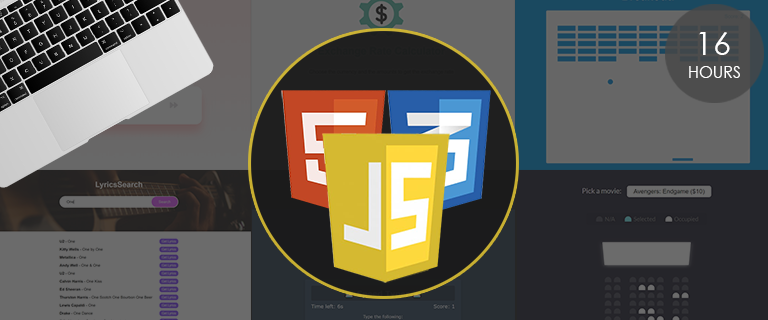

# [20 Web Projects With Vanilla JavaScript](https://www.udemy.com/course/web-projects-with-vanilla-javascript)

20 Mini Projects using HTML, CSS &amp; Vanilla JavaScript.

Taught by [Brad traversy](https://traversymedia.com)

## Topics Covered

- Create Layouts & UI's With HTML/CSS ( No CSS Frameworks )
- CSS Animations (Transitions, Keyframes, etc With JS Triggers)

- JavaScript Fundamentals

- DOM Selection & Manipulation

- JavaScript Events (Forms, buttons, scrolling, etc)

- Fetch API & JSON

- HTML5 Canvas

- The Audio & Video API

- Drag & Drop

- Web Speech API (Syth & Recognition)

- Working with Local Storage

- High Order Array Methods - forEach, map, filter, reduce, sort

- setTimout, setInterval

- Arrow Functions

# Projects

|  #  |                                                     Project                                                     |                                 Live Demo                                  |
| :-: | :-------------------------------------------------------------------------------------------------------------: | :------------------------------------------------------------------------: |
| 01  |         [Form Validator](https://github.com/bradtraversy/vanillawebprojects/tree/master/form-validator)         |    [Live Demo](https://vanillawebprojects.com/projects/form-validator/)    |
| 02  |     [Movie Seat Booking](https://github.com/bradtraversy/vanillawebprojects/tree/master/movie-seat-booking)     |  [Live Demo](https://vanillawebprojects.com/projects/movie-seat-booking/)  |
| 03  |    [Custom Video Player](https://github.com/bradtraversy/vanillawebprojects/tree/master/custom-video-player)    | [Live Demo](https://vanillawebprojects.com/projects/custom-video-player/)  |
| 04  |    [Exchange Rate Calculator](https://github.com/bradtraversy/vanillawebprojects/tree/master/exchange-rate)     |    [Live Demo](https://vanillawebprojects.com/projects/exchange-rate/)     |
| 05  |  [DOM Array Methods Project](https://github.com/bradtraversy/vanillawebprojects/tree/master/dom-array-methods)  |  [Live Demo](https://vanillawebprojects.com/projects/dom-array-methods/)   |
| 06  |     [Menu Slider & Modal](https://github.com/bradtraversy/vanillawebprojects/tree/master/modal-menu-slider)     |  [Live Demo](https://vanillawebprojects.com/projects/modal-menu-slider/)   |
| 07  |             [Hangman Game](https://github.com/bradtraversy/vanillawebprojects/tree/master/hangman)              |       [Live Demo](https://vanillawebprojects.com/projects/hangman/)        |
| 08  |          [Mealfinder App](https://github.com/bradtraversy/vanillawebprojects/tree/master/meal-finder)           |     [Live Demo](https://vanillawebprojects.com/projects/meal-finder/)      |
| 09  |        [Expense Tracker](https://github.com/bradtraversy/vanillawebprojects/tree/master/expense-tracker)        |   [Live Demo](https://vanillawebprojects.com/projects/expense-tracker/)    |
| 10  |           [Music Player](https://github.com/bradtraversy/vanillawebprojects/tree/master/music-player)           |     [Live Demo](https://vanillawebprojects.com/projects/music-player/)     |
| 11  |    [Infinite Scrolling](https://github.com/bradtraversy/vanillawebprojects/tree/master/infinite_scroll_blog)    | [Live Demo](https://vanillawebprojects.com/projects/infinite_scroll_blog/) |
| 12  |            [Typing Game](https://github.com/bradtraversy/vanillawebprojects/tree/master/typing-game)            |     [Live Demo](https://vanillawebprojects.com/projects/typing-game/)      |
| 13  |     [Speech Text Reader](https://github.com/bradtraversy/vanillawebprojects/tree/master/speech-text-reader)     |  [Live Demo](https://vanillawebprojects.com/projects/speech-text-reader/)  |
| 14  |           [Memory Cards](https://github.com/bradtraversy/vanillawebprojects/tree/master/memory-cards)           |     [Live Demo](https://vanillawebprojects.com/projects/memory-cards/)     |
| 15  |        [LyricsSearch App](https://github.com/bradtraversy/vanillawebprojects/tree/master/lyrics-search)         |    [Live Demo](https://vanillawebprojects.com/projects/lyrics-search/)     |
| 16  |            [Relaxer App](https://github.com/bradtraversy/vanillawebprojects/tree/master/relaxer-app)            |     [Live Demo](https://vanillawebprojects.com/projects//relaxer-app/)     |
| 17  |          [Breakout Game](https://github.com/bradtraversy/vanillawebprojects/tree/master/breakout-game)          |    [Live Demo](https://vanillawebprojects.com/projects/breakout-game/)     |
| 18  |     [New Year Countdown](https://github.com/bradtraversy/vanillawebprojects/tree/master/new-year-countdown)     |  [Live Demo](https://vanillawebprojects.com/projects/new-year-countdown/)  |
| 19  |          [Sortable List](https://github.com/bradtraversy/vanillawebprojects/tree/master/sortable-list)          |    [Live Demo](https://vanillawebprojects.com/projects/sortable-list/)     |
| 20  | [Speak Number Guessing Game](https://github.com/bradtraversy/vanillawebprojects/tree/master/speak-number-guess) |  [Live Demo](https://vanillawebprojects.com/projects/speak-number-guess/)  |
